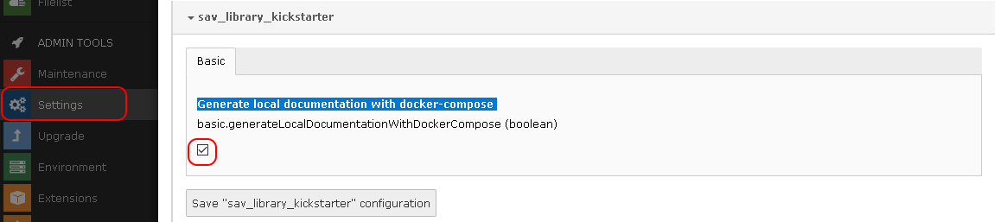
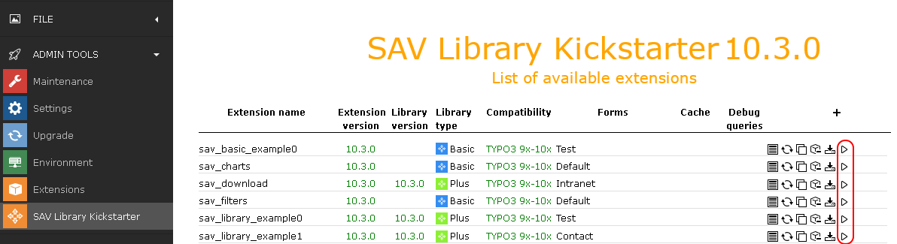
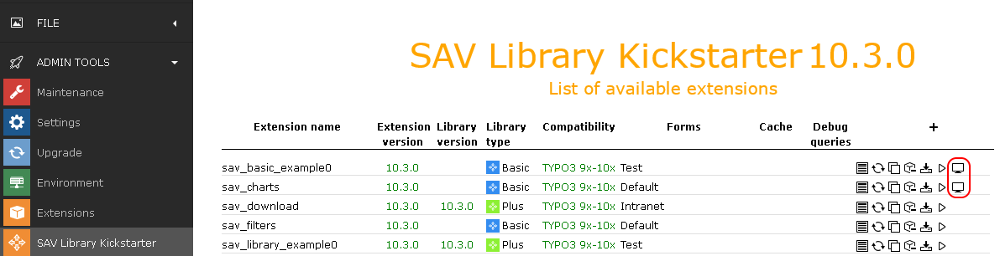
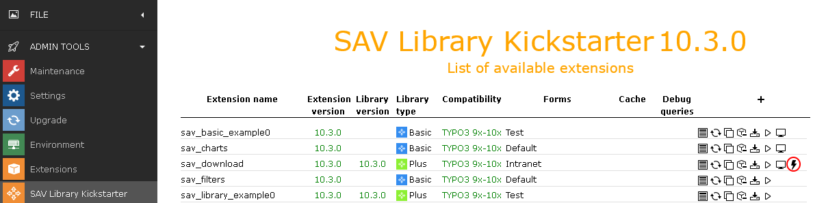

.. include:: ../Includes.txt

.. _configuration:

=============
Configuration
=============

.. important::

	Include the ``SAV Library Kickstarter static template``.

Generation of Local Documentation
---------------------------------

The Sav Library Kickstarter can generate local documentation for 
your extensions by means of ``docker-compose``.

This feature is enabled using the ``Extension configuration`` item in 
the ``ADMIN TOOLS -> Settings`` menu. Click on ``Configure extensions``,
choose ``sav_library_kickstarter``, then check 
``Generate local documentation with docker-compose`` and save the
configuration.

Once enabled a new icon is displayed in the Kickstarter Extension 
List in front of extensions which have a documentation.

Click on the icons to generate the local documentation. New icons
are shown, click on them to display the documentation.

If errors are detected during the generation a special icon
is displayed. Click on this icon to open the error file.

