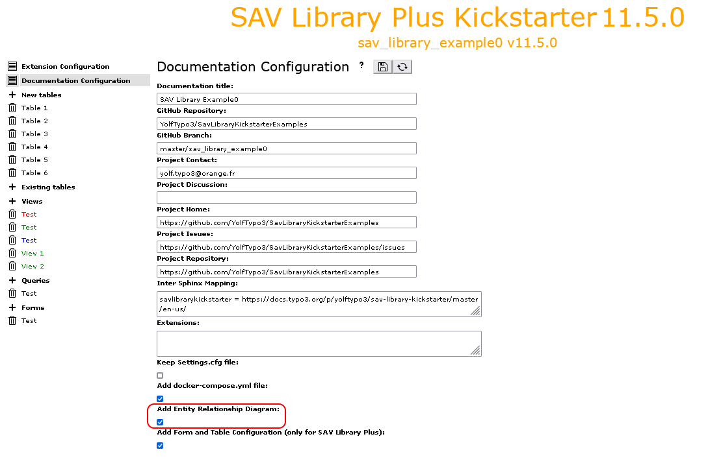
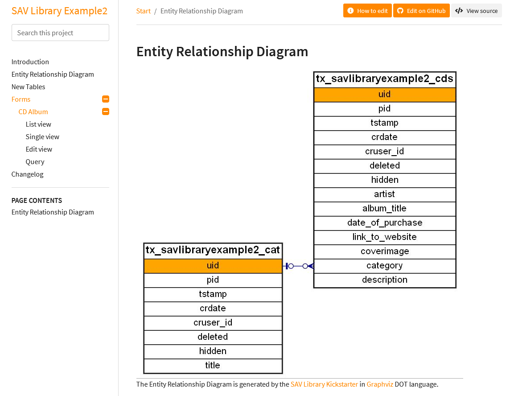

.. include:: ../Includes.txt

.. _configuration:

=============
Configuration
=============

.. important::

	Include the ``SAV Library Kickstarter static template``.
	
Generation of the Entity Relationship Diagram
---------------------------------------------

The Sav Library Kickstarter can generate Entity Relationship Diagrams 
in `Graphviz <https://graphviz.org/>`_ DOT language. 
	
.. important::
  
  ``Graphviz`` **must be installed on your server** if you use this option.
  
In Documentation section of the SAV Library Kickstarter, check 
``Add Entity Relationship Diagram:``.

The Entity Relationship Diagram will be added to the documentation when the 
extension is regenerated.

Generation of Local Documentation
---------------------------------

The Sav Library Kickstarter can generate local documentation for 
your extensions by means of ``docker-compose`` (see also :ref:`kickstarterMenu.documentationConfiguration`
for details about the configuration of the documentation generation).

.. important::
  
    ``docker-compose`` **must be installed to use this feature**. See the section
    `Rendering the documentation with Docker Compose 
    <https://docs.typo3.org/m/typo3/docs-how-to-document/main/en-us/RenderingDocs/RenderWithDockerCompose.html>`_
    for details.

.. note::

    For Basic type extension, the generated documentation contains only basic sections:
    
    - Introduction,
    - Entity Relationship Diagram, if enabled,
    - Changelog.
    
    Since the Table of Contents is always regenerated, if you add your own sections 
    to the documentation, add the file ``Documentation/TableOfContents.txt`` to your extension in the convention
    format for the table of contents. 
    
    For example, the extension `SAV Charts <https://docs.typo3.org/p/yolftypo3/sav-charts/11.5/en-us/>`_
    was generated by SAV Library Kickstarter as a ``Basic`` type extension. It has its
    specific sections for the documentation. In order to have the table of contents correctly regenerated, 
    the following content was added in the file ``Documentation/TableOfContents.txt``.
    
    ::

      UsersManual/Index
      Administration/Index
      Reference/Index
      Tutorial/Index
      FAQ/Index     
    
This feature is enabled using the ``Extension configuration`` item in 
the ``ADMIN TOOLS -> Settings`` menu. Click on ``Configure extensions``,
choose ``sav_library_kickstarter``, then check 
``Generate local documentation with docker-compose`` and save the
configuration.

.. figure:: ../Images/ConfigurationGenerationLocalDocumentation.png

Once enabled a new icon is displayed in the Kickstarter Extension 
List in front of extensions which have a documentation.

.. figure:: ../Images/ConfigurationGenerateButton.png

Click on the icons to generate the local documentation. New icons
are shown, click on them to display the documentation.

.. figure:: ../Images/ConfigurationDisplayButton.png

If errors are detected during the generation a special icon
is displayed. Click on this icon to open the error file.

.. figure:: ../Images/ConfigurationErrorButton.png
