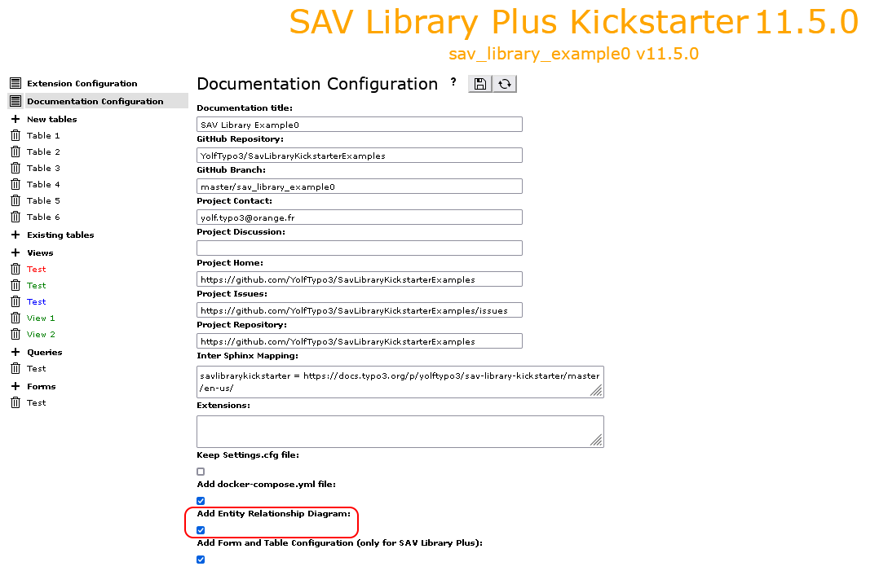

.. include:: ../Includes.txt

.. _configuration:

=============
Configuration
=============
	
Generation of the Entity Relationship Diagram
---------------------------------------------

The Sav Library Kickstarter can generate Entity Relationship Diagrams 
in `Graphviz <https://graphviz.org/>`_ DOT language. 
	  
In Documentation section of the SAV Library Kickstarter, check 
``Add Entity Relationship Diagram:``.

The Entity Relationship Diagram will be added to the documentation when the 
extension is regenerated.

.. figure:: ../Images/UsersManualKickstarterMenuDocumentationSavLibraryExample2.png 

Generation of Documentation
---------------------------------

The Sav Library Kickstarter can generate documentation for 
your extensions by means of ``docker`` (see also :ref:`kickstarterMenu.documentationConfiguration`
for details about the configuration of the documentation generation).

.. note::

    For Basic type extension, the generated documentation contains only basic sections:
    
    - Introduction,
    - Entity Relationship Diagram, if enabled,
    - Changelog.
    
    Since the Table of Contents is always regenerated, if you add your own sections 
    to the documentation, add the file ``Documentation/TableOfContents.txt`` to your extension in the conventional
    format for the table of contents. 
    
    For example, the extension `SAV Charts <https://docs.typo3.org/p/yolftypo3/sav-charts/11.5/en-us/>`_
    was generated by SAV Library Kickstarter as a ``Basic`` type extension. It has its
    specific sections for the documentation. In order to have the table of contents correctly regenerated, 
    the following content was added in the file ``Documentation/TableOfContents.txt``.
    
    ::

      UsersManual/Index
      Administration/Index
      Reference/Index
      Tutorial/Index
      FAQ/Index     
    
