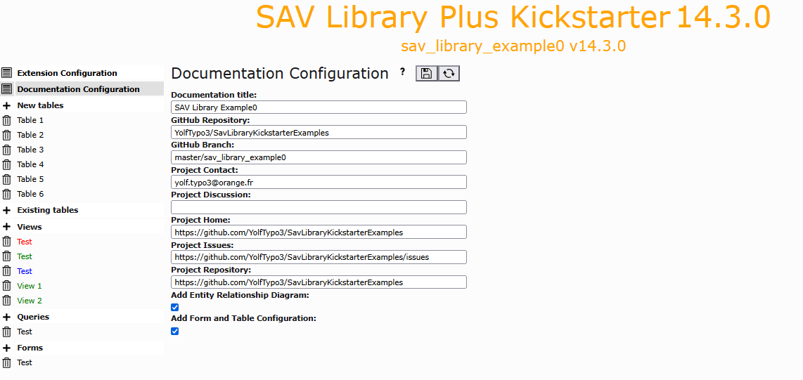
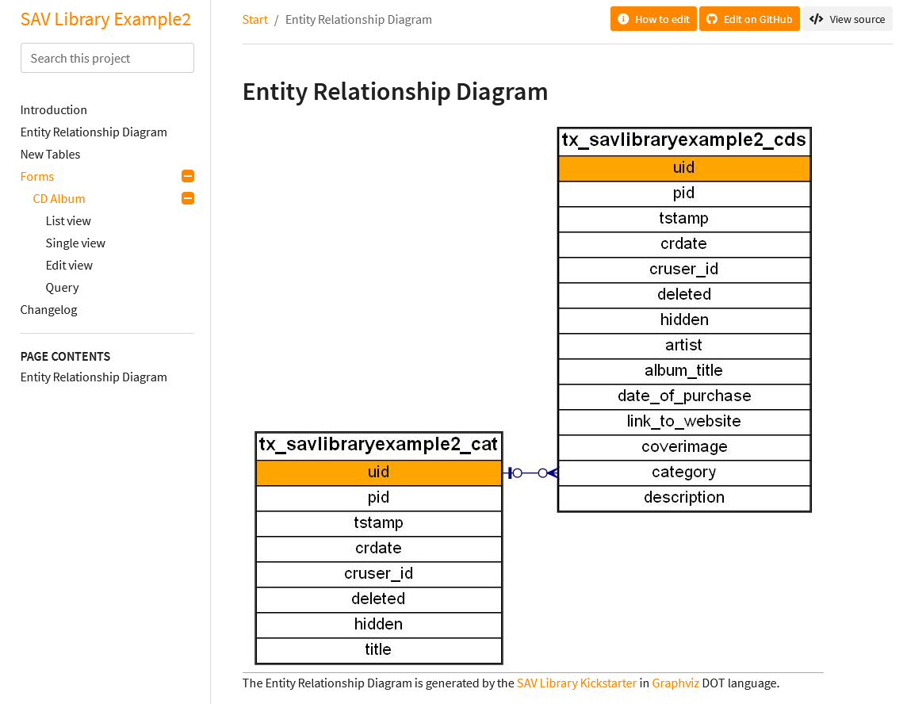

.. include:: ../../../Includes.txt

.. _kickstarterMenu.documentationConfiguration:

===========================
Documentation Configuration
===========================

This item opens the form used to generate the documentation of the extension.

.. tip::
   
   Click on the icons at the right hand side of ``Documentation Configuration``:
   
   - to access to this section of the documentation.
   - to save the configuration
   - to generate the extension.

- **Documentation title**: title which will be shown in the documenation.

- **GitHub Repository**: GitHub repository if any.

- **GitHub Branch**: GitHub branch if any. 

- **Project Contact**: contact for this project. 

- **Project Discussion**: URL of the project discussion, if any.

- **Project Home**: URL of the project home, if any.

- **Project Issues**: URL of the project issues, if any.

- **Project Repository**: URL of the project repository, if any.

- **Add Entity Relationship Diagram**: set this option if you want to generate 
  the Entity Relationship Diagram. The Entity Relationship Diagram is generated by in `Graphviz 
  <https://graphviz.org/>`_ DOT language. 
    
- **Add Form and Table Configuration (only for SAV Library Plus and SAV Library Mvc):**: set this option if you 
  want to generate a full documentation of the configuration of the forms and tables used in your
  extension for SAV Library Plus and SAV Library Mvc. 
  
The following figure shows the Entity Relationship Diagram for the extension  
`sav_library_example2 <https://extensions.typo3.org/extension/sav_library_example2>`_. 
As it can be seen on the left hand side menu, the documentation includes the form and the tables
used in the extension.
 
