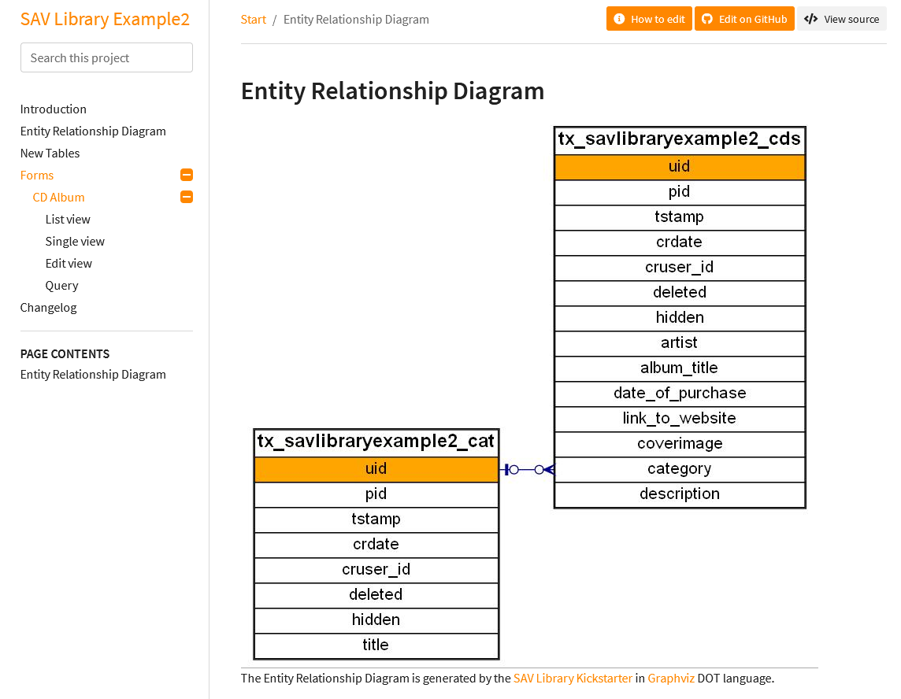

.. include:: ../../../Includes.txt

.. _kickstarterMenu.documentationConfiguration:

===========================
Documentation Configuration
===========================

This item opens the form used to generate the documentation of the extension.

.. tip::
   
   Click on the icons at the right hand side of ``Documentation Configuration``:
   
   - to access to this section of the documentation.
   - to save the configuration
   - to generate the extension.

- **Documentation title**: title which will be shown in the documenation.

- **GitHub Repository**: GitHub repository if any.

- **GitHub Branch**: GitHub branch if any. 

- **Project Contact**: contact for this project. 

- **Project Discussion**: URL of the project discussion, if any.

- **Project Home**: URL of the project home, if any.

- **Project Issues**: URL of the project issues, if any.

- **Project Repository**: URL of the project repository, if any.

- **Inter Sphinx Mapping**: use this field to define tags for 
  references to other documents. In the extension `sav_library_example0 
  <https://extensions.typo3.org/extension/sav_library_example0>`_ a tag 
  to the SAV Library Kickstarter is defined as follows.
  
  ::
  
     savlibrarykickstarter = https://docs.typo3.org/typo3cms/extensions/sav_library_kickstarter
     
  This tag is used in the introduction section as follows.
  
  ::
  
     ... read the :ref:`SAV Library Kickstarter tutorial section <savlibrarykickstarter:tutorial>` 

- **Extensions**: extensions that will be added in the ``Settings.cfg`` file.

- **Keep Settings.cfg file**: set this option if you ``manually`` modify
  the ``Settings.cfg`` file. It will prevent the SAV Library Kickstarter
  to rebuild it.
  
- **Add docker-compose.yml file**: set this option if you want to generate 
  the documentation on your server using ``docker-compose`` from your extension
  directory.  
  
  ::
  
     docker-compose run --rm t3docmake
     
  The ``docker-compose.yml`` is such that the documentation will be 
  generated in the directory ``typo3conf/Documentation`` of your server.   

- **Add Entity Relationship Diagram**: set this option if you want to generate 
  the Entity Relationship Diagram. The Entity Relationship Diagram is generated by in `Graphviz 
  <https://graphviz.org/>`_ DOT language. 
    
- **Add Form and Table Configuration (only for SAV Library Plus):**: set this option if you 
  want to generate a full documentation of the configuration of the forms and tables used in your
  extension for SAV Library Plus. 
  
The following figure shows the Entity Relationship Diagram for the extension  
`sav_library_example2 <https://extensions.typo3.org/extension/sav_library_example2>`_. 
As it can be seen on the left hand side menu, the documentation includes the form and the tables
used in the extension.
 
