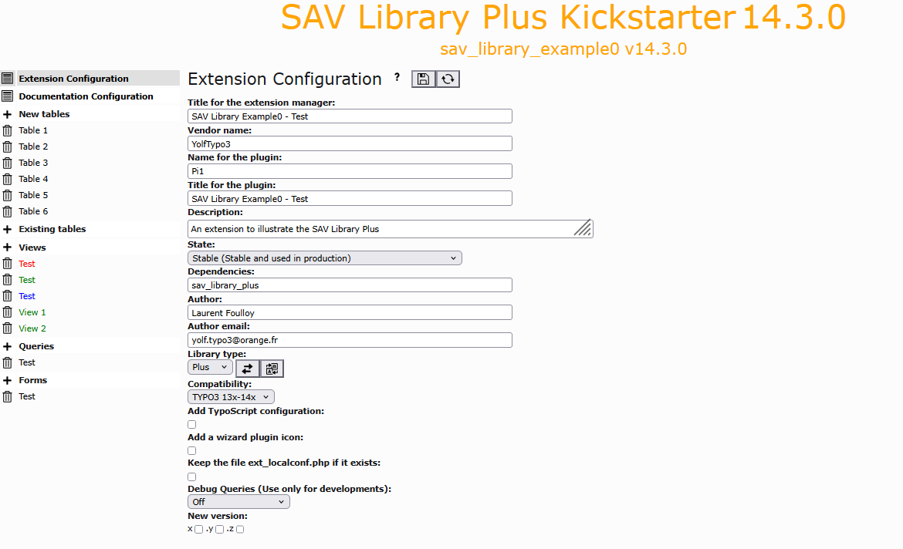

.. include:: ../../../Includes.txt

.. _kickstarterMenu.extensionConfiguration:

=======================
Extension Configuration
=======================

This item opens the form for the configuration of the extension.

.. tip::
   
   Click on the icons at the right hand side of ``Extension Configuration``:
   
   - to access to this section of the documentation.
   - to save your configuration.
   - to generate the extension.

- **Title for the extension manager**: title which will be displayed in 
  extension manager.
  
- **Vendor name**: vendor name (**mandatory**).

- **Title for the plugin**: title which will be displayed in the 
  plugin selector. 
  
- **Description**: use this field to describe the aim of the 
  extension. 
  
- **State**: selector which specifies the state of the extension.

- **Dependencies**: specify here the dependencies of the extension.
  
  Dependencies must be comma-separated. If only extension names
  are entered, dependencies will be added in ``ext_emconf.php``
  file without constraints.

  The SAV Library Kickstarter generates automatically the dependency
  to SAV Library Plus or SAV Library Mvc for ``composer.json`` and
  ``ext_emconf.php`` files.
  
  Constraints can be added for ``ext_emconf.php`` or ``composer.json``.
  The following example is taken from the extension `sav_library_example10 
  <https://extensions.typo3.org/extension/sav_library_example10>`_ which 
  depends on extension `maps2 <https://extensions.typo3.org/extension/maps2>`_.
 
  
  .. code::
     
     maps2(emconf:13.0.0-0.0.0), jweiland/maps2(composer:^13.0)
     
  The dependency to ``maps2`` will be added to ``ext_emconf.php`` with the 
  constraint ``13.0.0-0.0.0``.
  
  .. code::
  
        'depends' => [
            'typo3' => '13.4.0-14.3.99',
            'maps2' => '13.0.0-0.0.0',
            'sav_library_plus' => '14.3.0-14.3.99'
        ],   
  
  The extension ``maps2`` has a composer support ``jweiland/maps2``. In 
  such case, you must enter directly the dependency, i.e. ``jweiland/maps2``,
  instead of the extension name. The dependency 
  is added to ``composer.json`` with the constraint ``^13.0``.
  
  .. code::
  
    "require": {
        "typo3/cms-core": "^13.4|^14.3",
        "jweiland/maps2": "^13.0",
        "yolftypo3/sav-library-plus": "^13.4|^14.3"
    },
  
- **Author**: use this field to set the extension's author.   

- **Author email**: use this field to set the author's email.

- **Library type**: selector which specifies the type of extension
  which will be generated. The ``Basic`` type can be used to kickstart
  extension using Fluid and Exbase. Icons at the right hand side of
  the selector are still experimental. They should make it possible
  to migrate a ``Plus`` type extension to a ``Mvc`` type extension 
  and vice-versa.
  
- **Compatibility**: selector which defines the compatibility of the
  extension. This selector evolves with the version of TYPO3. If an extension
  becomes incompatible, it has to be upgraded. 

- **Add TypoScript configuration**: if selected, TypoScript configuration files are
  added (only for ``Plus`` type. For ``Basic`` and ``Mvc`` TypoScript configuration files are
  always added).

- **Keep the file ext_localconf.php if it exists**: set this option 
  if you ``manually`` modify the ``ext_localconf.php`` file. 
  It will prevent the SAV Library Kickstarter to rebuild it.
  
- **Debug Queries (Use only for developments)**: selector which defines
  the level of debuging. The options are:
  
  - ``Off``: no debugging is provided.
  - ``Queries with errors``: debugging is provided for queries with errors.
  - ``All queries``: debugging is provided for all queries.

  .. warning::
  
    For security reasons, set this selector to ``Off`` in the 
    final version of your extension.
  
  By default, debug information is provided by the TYPO3 Core ``debug()`` function.
  However, it is often easier to use the TYPO3 Logging system by adding the 
  following configuration to ``typo3conf/AdditionalConfiguration.php``:
  
  .. code::
  
    $GLOBALS['TYPO3_CONF_VARS']['LOG']['YolfTypo3']['SavLibraryPlus']['writerConfiguration'] = [
        \TYPO3\CMS\Core\Log\LogLevel::DEBUG => [
            \TYPO3\CMS\Core\Log\Writer\FileWriter::class => [
                'logFile' => \TYPO3\CMS\Core\Core\Environment::getVarPath() . '/log/SavLibraryPlus.log'
            ],
        ],
    ];
  
- **New version**: use these checkboxes to automatically ugrade the version of your extension.

  .. tip::
  
     - If you set z, one unit will be added to the z part.
     - It you set y, one unit will be added to the y part, while the z part is reset to 0.
     - If you set x, one unit, will be added to the x part, while the y and z parts will be reset.

